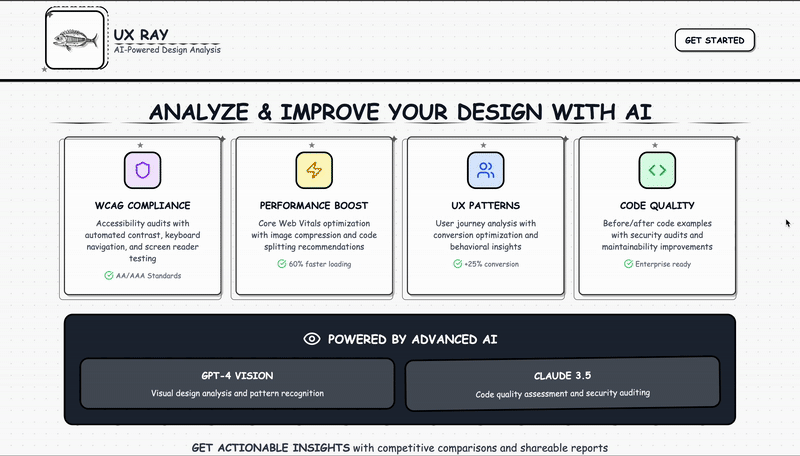

## Link to website: https://uxray.anst-dem.com/
### or https://web-design-oracle.lovable.app/ if the link above is currently not working


This project aim to analyse web design based on website's URL using AI API (groqApi).
Analysis includes: overall score (with shareing in Instagram), competitive analysis, comparison with competitors, analysis by categories (with filtering), improvement suggestions (including code improvement), visual design annotations, download final report.

## How to use?

```sh
# Step 1: Clone the repository.
git clone https://github.com/stDem/AI-Web-Design-Analysis.git

# Step 2: Navigate to the project directory.
cd AI-Web-Design-Analysis

# Step 3: Install the necessary dependencies.
npm i

# Step 4: Start the development server with auto-reloading and an instant preview.
npm run dev
```

## What technologies are used for this project?

This project is built with Lovable with:

- Vite
- TypeScript
- React
- shadcn-ui
- Tailwind CSS
